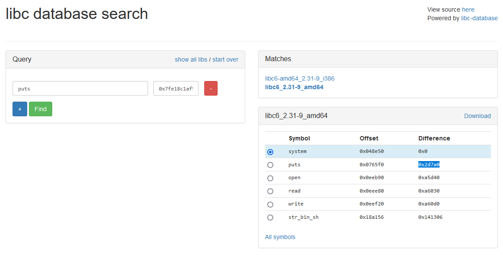

# DEFCON 29 Red Team Village CTF - MiniVbox

Exploit works with **python3**. 


To start the target:

```
nc -v -l -p 5555 -e ./target
```


Running exploit:

```
python3 script.py 127.0.0.1 5555
```

When exploit will pause and ask for system offset. Go to https://libc.blukat.me/ and search for **received puts address** given by the exploit. Then take the difference between system and puts and put it to script prompt as a hex value. After that, the script will resume execution.



Exploit run result:


**Vulnerability**

One of the counters used by handle_read/handle_write can be wrapped around into negative value and later this can be used to bypass check in handle_read to read outside of buffer and in handle_write to write outside of buffer.

Example read outside of buffer:


The sequence of commands shown above triggers a read outside the buffer and in effect leak of pointers.
