# **Quarkslab Challenge 2021 or how I learned AES the hard way**


### [The challenge](https://quarkslab.com/challenge-quarkslab-2021/)

The task was described as follows:

```
AES is so backdoored; we decided to make our own version of it. To top it off, we added
military-grade mathematics, “they” will never ever manage to break.

If you feel like it, try and decrypt the provided message.

We also give you the binary that we used to generate it.

It’s obfuscated so that we can still keep our disruptive design secret!

Good luck!
```

Along with the description come two files chall_encrypt_cbc and chall_message.encr.

### Initial look

So they decided to make their own version of AES. This made me assume that they've created some custom block cipher algorithm. Provided binary is named chall_encrypt_cbc, CBC in the name lets me assume that it uses Cipher Block Chaining. In this mode each block of plain text is XORed with previous block of ciphertext before encryption. First block of plain text is XORed with additional block called IV(initialization Vector). The IV should be unique for every message.

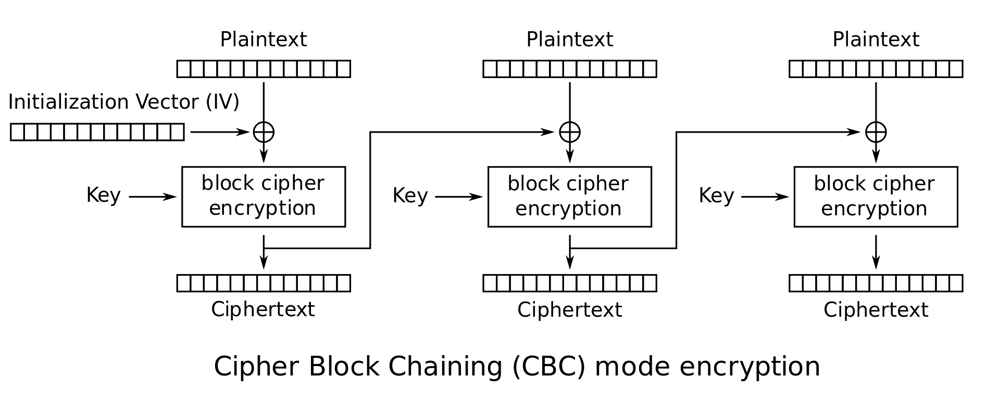

Executable takes three arguments: 16-character key in hex format, name of file containing plain text message and name of file where ciphertext will be saved. I executed the file with all-zero key and empty plain text message file. In result, I got an output ciphertext containing 16 bytes. 

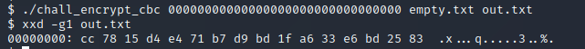

This suggests that the algorithm operates on 16 byte blocks and the first block of plain text as well as the initialization vector are hard coded in the binary. 

### Digging in the assembly

Time to look at the binary internals. There are three important parts there. First, there is the main which is located at .text:00000000000010F0. The function reads the key, the input file name and the output file name. It opens the files and then does the encryption. The encryption part is shown below.

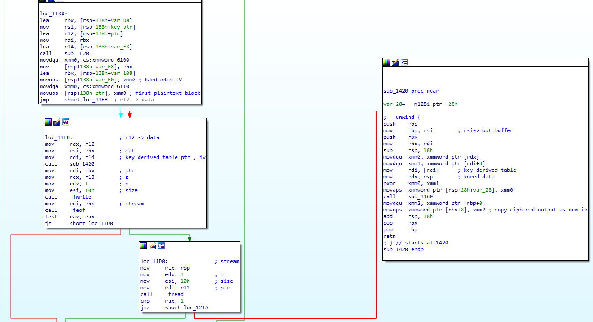

There are two other functions that do encryption. Each of these functions is a long slab of obfuscated assembly code. 

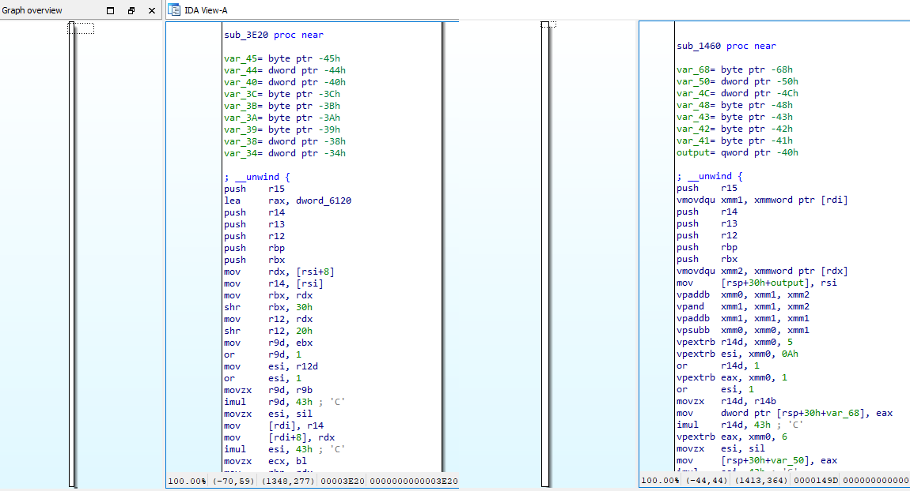

There are two main obfuscation techniques used here. The assembly code for different higher level operations is mingled. The XOR operation is not being done directly. Instead, it is done as a series of operations:
```C
out = (a - b) + 2 * (b &  ~a);
```
another obfuscation of XOR:
```C
out = (a + b) - 2 * (a & b);
```
It took me quite a few long evenings to figure these two functions out.

**sub_3E20** is a function that expands a 16-byte key into 176 bytes. First 16 bytes are a copy of the given key. The remaining ten 16-byte chunks are created using the following algorithm:

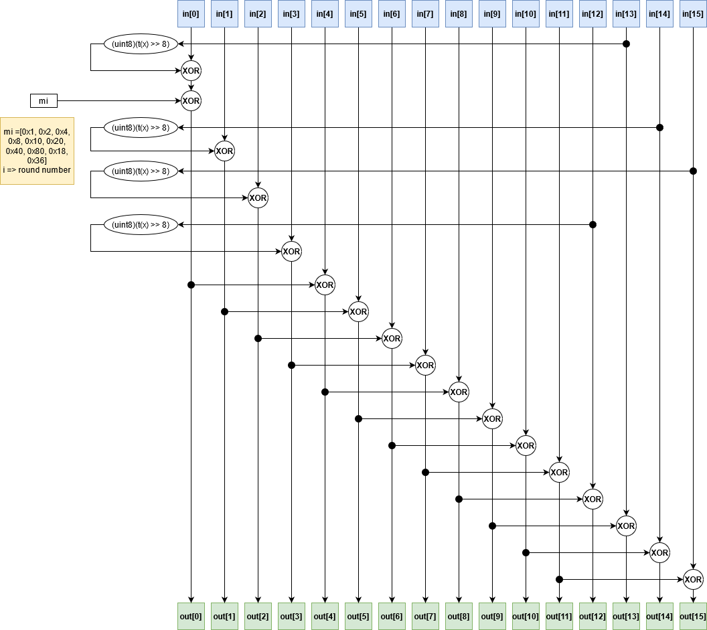

**sub_1460** is a function which does the actual encryption. Before encryption input data are being XORed with IV for the current round. First IV is hard coded and stored under .rodata:0000000000006100. Plain text data for the first encryption round are stored under .rodata:0000000000006110.

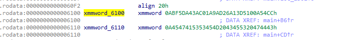

Encryption algorithm is composed of 12 rounds. First round is a simple XOR with key (first 16 bytes of expanded key). Rounds 2-10 are done as follows:

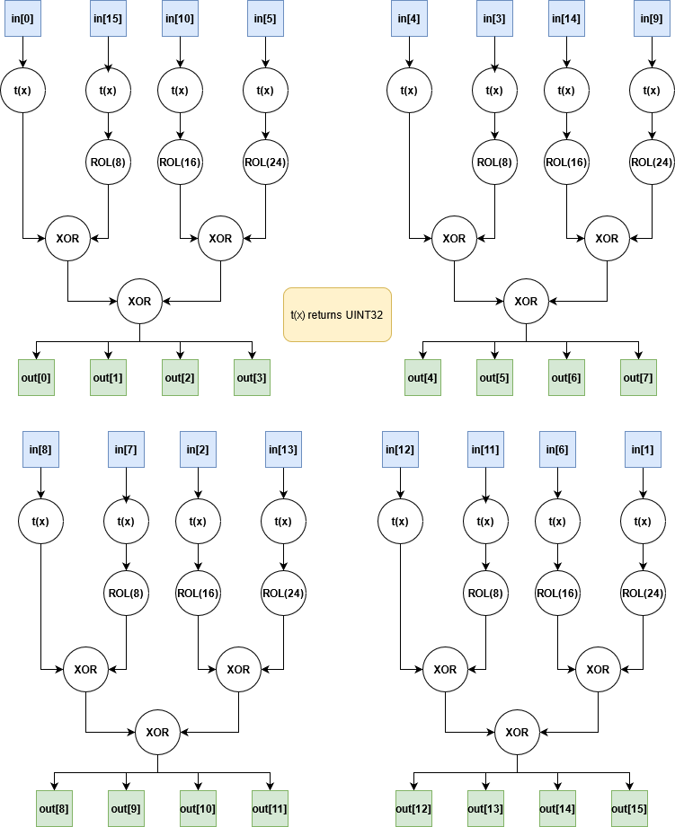

**After that at the end of each round, the result of the calculation from the upper diagram is XORed with corresponding 16 bytes from the expanded key.**.


Round 11 is slightly simpler

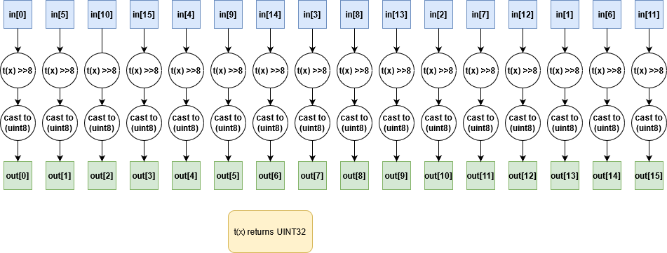

**At the end of the round, the result is XORed with the last 16 bytes from the expanded key**


In the 12th round, 16 bytes of input are divided into 4 dwords and for each dword the result of the following quadratic equation is computed.
<p align="center">y =  621221138*x<sup>2</sup> -1427868995*x + 211712510</p>

This is done using the SSE assembly instructions.

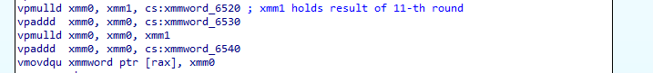

The 4 dwords of the result are stored as a ciphertext block and copied into a 16-byte variable on the stack where it will serve as the IV for encryption of the next block.

To decipher the message first, I had to reverse the 12th round of encryption. Because of the magnitude of parameters in the quadratic equation, the result will always be greater than 4 byte range. Yet in ciphertext I get only the last 4 bytes of the number. I couldn't solve the equation in traditional high school fashion by subtracting ciphertext value from C parameter, calculating the delta and then computing the roots of the equation. After hours of browsing various mathematics sites, I found that this kind of thing is called Quadratic Congruence.

> The Quadratic Congruence in one variable is given by ax^2+bx+c ≡0(mod p)Where a, b, c are integers, p is an odd prime and p∤a (p does not divide a )
>
> [source article ](https://www.patnauniversity.ac.in/e-content/science/math/Number+Theory.pdf)

After some more searching, I found a couple of github repos with code that is capable of solving this kind of problems. Some of them didn't work correctly with this equation, but eventually I found one that was giving results in line with some test data I generated. (https://github.com/elmomoilanen/Quadratic-congruence-solver)

### Hard Times

My first approach was to retrieve the key. Since the key expansion procedure is 100% reversible, if I could extract a key value from the 11th round, I could reverse the key generation procedure and get to the original key. That didn't work. I tried flipping single bits in a test key and measuring how much change that would cause in the resulting ciphertext (for hard coded plain text and IV) to narrow key search space. But a single flip of any bit in the key caused around 56 bits to change in the resulting message, and the difference was evenly distributed across all bytes of ciphertext. I tried many other things. In despair, I tried to throw ANGR at this thing and see if it would give any results. But the only result I got was a huge dust build-up on the radiators of my machine. I spent many long afternoons and evenings trying to get to the bottom of this. The mood was low, and progress was stalled. Being out of ideas, I started to watch cryptanalysis videos from [Maria Eichlseder](https://www.youtube.com/user/pardilchen). In the video about differential cryptanalysis, in the middle of the lecture she started to explain the internals of AES. I paused the video, looked at my notes, then at the video again… And then the revelation came.  

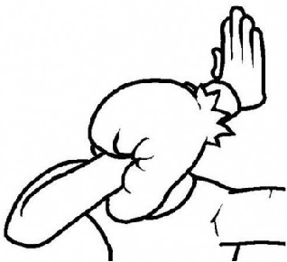

This is AES-128. At least in its linear part. And I've been trying to beat one of the most secure cryptographic algorithms for almost two months. Great job Me.

### Finally I know what I’m working with

First, let’s have a look at AES for reference (original source of this diagram [here](https://www.programmersought.com/article/49325934275/)).

[![aes block diagram][1]][2]

[1]:  imgs/aes_diag.jpeg
[2]: https://www.programmersought.com/article/49325934275/ "Redirect to source page"

The key expansion is a straight-up copy of AES-128. If you compare sub_1460 function diagram to the original AES-128 key expansion algorithm, it is clear that t(x) >> 8 has to implement the s-box.  t(x) is implemented in assembly as follows. 

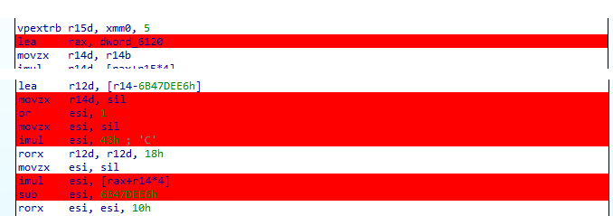

This translates to: 
```C 
ESI = dword_6120[ SIL ] * (unsigned char)(67 * ( SIL | 1)) – 1799872230;
```

dword_6120 is a hard-coded table containing 256 dword values. S-box value is obtained by shifting the result of this calculation 8 bits to the right and then taking the lowest 8bits as an output value.
 	
Encryption procedure is a little more convoluted, but its rounds 1-11 are equivalent (on the linear part) to AES-128 encryption rounds. When comparing the diagram of the encryption function and row shifting in AES, it is visible that input byte indexes in the function from challenge binary are similar to Input byte indexes in AES-128 after row shifting. 

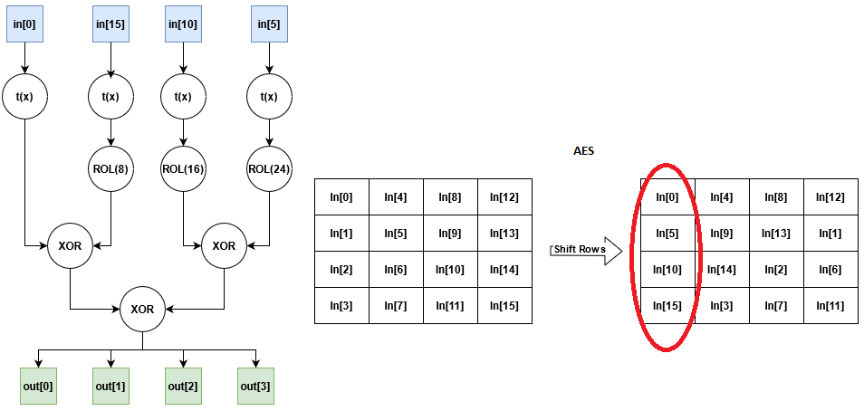

t(x) is a very interesting piece. As mentioned earlier, shifting the result of t(x) 8 bits to the right and taking the lowest 8 bits gives a S-box value for a given x. But t(x) serves an additional purpose here. Looking at results of t(x) for different x values.

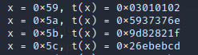

For x = 0x59, two middle bytes of the result are equal, the least significant byte is middle byte value multiplied by 2, and the most significant byte is middle byte multiplied by 3. However, for the remaining x values, this is not true. It’s because 2x and 3x multiplication is done within the Gallois field GF(2^8). This is not typical modulo multiplications but polynomial multiplications modulo x^8 + x^4 + x^3 + x + 1 (If you want to learn more about this I recommend [Lecture 7: Introduction to Galois Fields for the AES by Christof Paar](https://www.youtube.com/watch?v=x1v2tX4_dkQ).).  In sum, the output from t(x) has the following form:

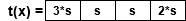

<p style="text-align: center;">(* in GF(2<sup>8</sup>) mod ( x<sup>8</sup> + x<sup>4</sup> + x<sup>3</sup> + x + 1)</p>

Multipliers are the same as in a column mixing matrix in AES:

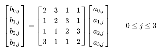

This means that t(x) implements S-box and column mixing from the original AES. When the output from t(x) is combined with ROL and XOR operations from the diagram, it turns out that the output for each 4-byte fragment is exactly the same as the output column value from the AES state array after column mixing. In other words, as mentioned before, this whole algorithm is a slightly convoluted equivalent of the linear part of the AES algorithm.

To test this, I generated s-box output for 0-256 input values (using dword_6120 values and t(x)>>8 operation formula copied into a simple C program). 

```
   | 00 01 02 03 04 05 06 07 08 09 0a 0b 0c 0d 0e 0f 
----------------------------------------------------
00 | cf 7a 4c f9 90 25 13 a6 00 b5 83 36 5f ea dc 69
10 | 2b 9e a8 1d 74 c1 f7 42 e4 51 67 d2 bb 0e 38 8d
20 | 3a 8f b9 0c 65 d0 e6 53 f5 40 76 c3 aa 1f 29 9c
30 | de 6b 5d e8 81 34 02 b7 11 a4 92 27 4e fb cd 78
40 | 9f 2a 1c a9 c0 75 43 f6 50 e5 d3 66 0f ba 8c 39
50 | 7b ce f8 4d 24 91 a7 12 b4 01 37 82 eb 5e 68 dd
60 | 6a df e9 5c 35 80 b6 03 a5 10 26 93 fa 4f 79 cc
70 | 8e 3b 0d b8 d1 64 52 e7 41 f4 c2 77 1e ab 9d 28
80 | 2e 9b ad 18 71 c4 f2 47 e1 54 62 d7 be 0b 3d 88
90 | ca 7f 49 fc 95 20 16 a3 05 b0 86 33 5a ef d9 6c
a0 | db 6e 58 ed 84 31 07 b2 14 a1 97 22 4b fe c8 7d
b0 | 3f 8a bc 09 60 d5 e3 56 f0 45 73 c6 af 1a 2c 99
c0 | 7e cb fd 48 21 94 a2 17 b1 04 32 87 ee 5b 6d d8
d0 | 9a 2f 19 ac c5 70 46 f3 55 e0 d6 63 0a bf 89 3c
e0 | 8b 3e 08 bd d4 61 57 e2 44 f1 c7 72 1b ae 98 2d
f0 | 6f da ec 59 30 85 b3 06 a0 15 23 96 ff 4a 7c c9

```

Comparing with the original AES s-box lookup table, it turns out this s-box is different. I did a series of experiments using [tinyAES](https://github.com/kokke/tiny-AES-c) C library. I've generated a reverse s-box table to the s-box from a challenge. Then I replaced s-box and reverse s-box in [tinyAES](https://github.com/kokke/tiny-AES-c) with the ones from the challenge. Next I encrypted the first 16 bytes that are given to the encryption procedure in the challenge binary, but using modified [tinyAES](https://github.com/kokke/tiny-AES-c) (the key was all zeros).  Then I compared the obtained ciphertext with 11th round output in challenge binary (also with all-zero key, and breakpoint on encryption of first 16 bytes).

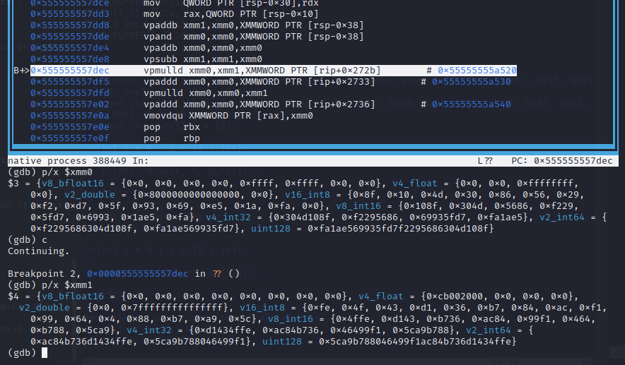

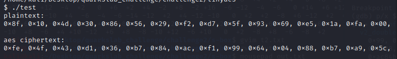

And as expected, output from the 11th round in the challenge binary matches output generated by modified tinyAES. In summary, the challenge binary implements AES-128 with altered S-box with additional mathematical transformation using quadratic equation at the end.

### The weakness

If the linear part is equivalent to AES-128, the weakness has to be hidden in the S-box. I generated a Linear Approximation Table for the S-box. Using this table, I created Jackson-Pollock representation (I used the code from [here]( https://who.paris.inria.fr/Leo.Perrin/teaching/tutorial-sbox.html#sec-2-1)).

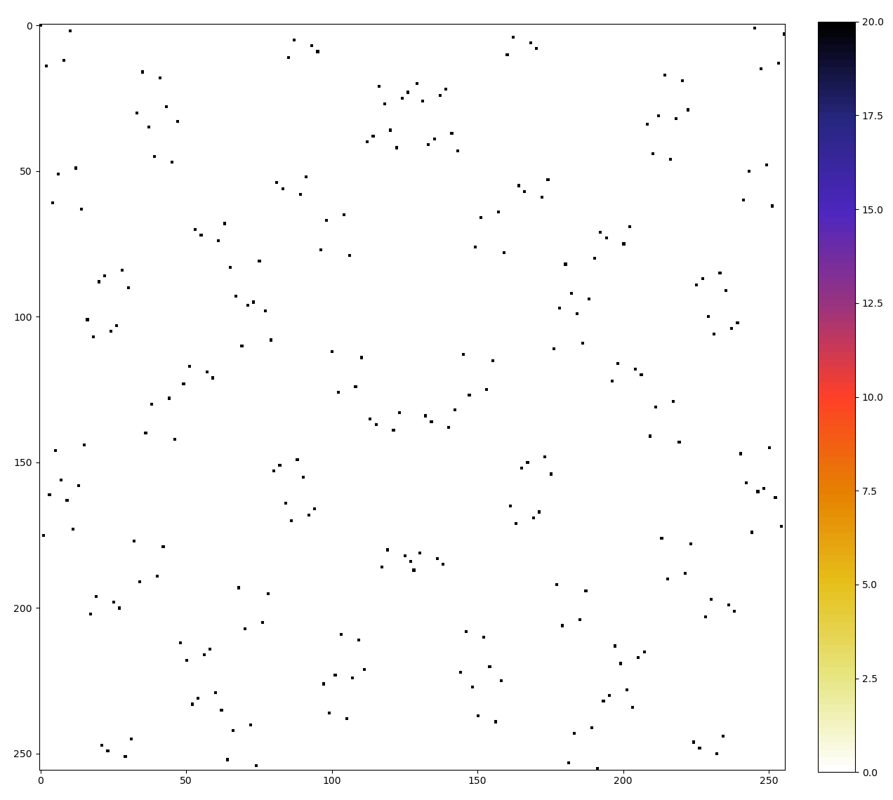

for comparison Jackson-Pollock representation for original AES S-box.

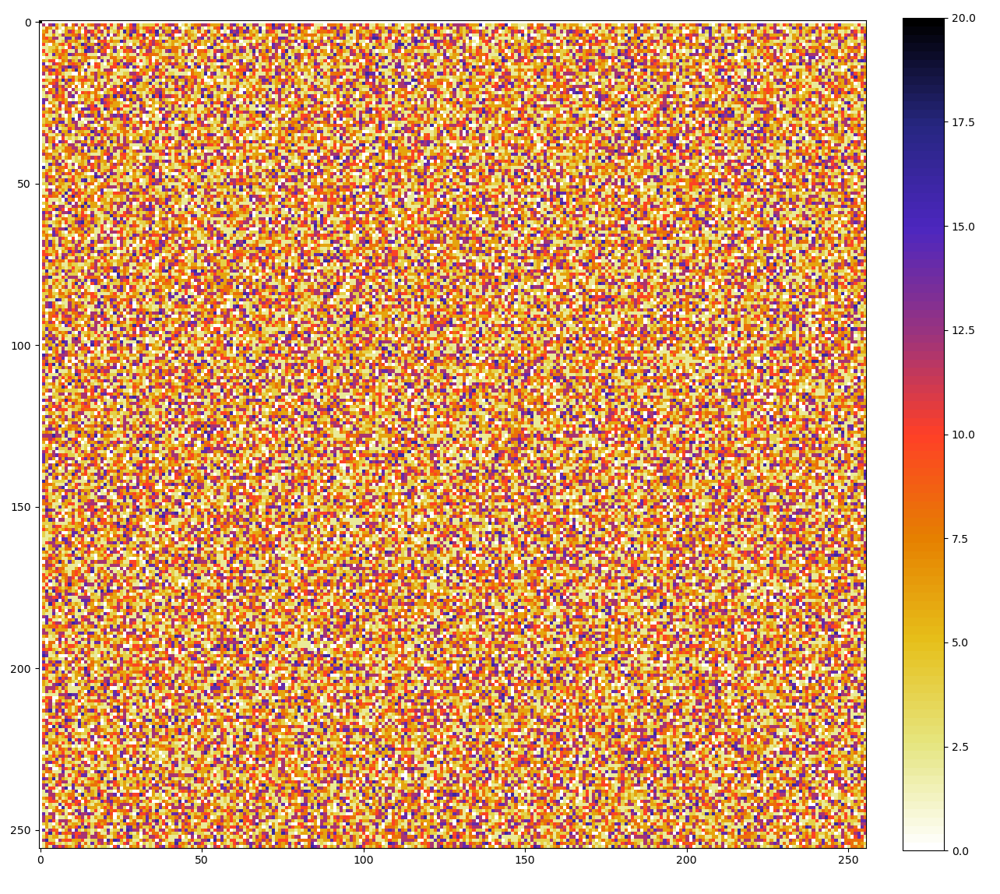

Even with my limited cryptanalysis knowledge, I could see that something is very wrong here. In the LAT of the s-box from the challenge binary, each row has only one non-zero value, and it’s always the same number (-128). This lets me assume that the function behind S-box is 100% linear.


### So how do I beat this thing? 

The encrypted message from challenge is 2288 bytes long (143 blocks of 16 bytes). I know the first 16 bytes of related plain text and IV (they are hard coded in the encryption binary). The algorithm uses CBC, so N+1 input data block is equal to XOR of N ciphertext block (output of 12th round) with N+1 plain text message block. So the N+1 ciphertext block is a ciphered difference between the previous ciphertext block and the current plain text block. 

Now if I take two output blocks from the 11th round (before quadratic equation calculation) and XOR them, I would get the difference between these blocks without round keys. The key values are canceled out in XOR operation since they are the same for both blocks and round keys from rounds before 11 should cancel out as well because of linearity of the S-box. Next if I run decryption on this difference block with the expanded key set to all zeros, I should get a difference between plain texts.

I prepared two 16-byte plain text blocks which differed by only one byte. I encrypted them with the same key using tinyAES with modified S-box. Then I computed XOR of the resulting ciphertexts. Next  I zeroed a part of the tinyAes context structure that was holding the expanded key and did AES decryption on the difference between ciphertexts. 

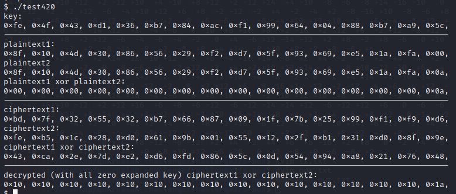

The result was the difference between ciphertexts XOR 10 10 10 10 10 10 10 10 10 10 10 10 10 10 10 10. I repeated this experiment multiple times with different keys, and the result was always following this pattern.

This means I could retrieve and decrypt the differences between adjacent ciphertext blocks from the challenge message. And then, since I know the first plain text block of the message, with the use of these differences, I can sequentially recreate the following blocks of plain text. All that without knowing the key.

The algorithm for the solution is as follows:

```
START

INIT tinyAES context
zero expanded key structure in tinyAES context.

xor_constant := [0x10, 0x10, 0x10, 0x10, 0x10, 0x10, 0x10, 0x10, 0x10, 0x10, 0x10, 0x10, 0x10, 0x10, 0x10, 0x10]
Known_plain_text := [0x43, 0x44, 0x47, 0x20, 0x53, 0x45, 0x43, 0x20, 0x4D, 0x45, 0x53, 0x53, 0x41, 0x47, 0x45, 0x0A]
iv := [0xCC, 0x54, 0x0A, 0x10, 0xD5, 0x13, 0x6A, 0xD2, 0x9A, 0x1A, 0xC0, 0x3A, 0xA4, 0x5D, 0xBF, 0x0A]

round_IV := iv XOR Known_plain_text

FirstAdjecentBlock := READ 16 bytes from chall_message.encr
FirstAdjecentCipherTextRound11 := COMPUTE quadratic congruence for FirstAdjecentBlock 

WHILE SeconAdjecentBlock := READ 16 bytes from chall_message.encr

	SecondAdjecentCipherTextRound11 := COMPUTE quadratic congruence for SecondtAdjecentBlock 

	Encrypted_Difference := FirstAdjecentCipherText XOR SecondAdjecentCipherText 

	Decrypted_difference := COMPUTE AESdecrypt on Encrypted_Difference

	Intermediate1 := Decrypted_difference XOR xor_constant
	Intermediate2 := round_IV XOR Intermediate1 

	round_IV := Intermediate2

	Known_plain_text := Intermediate2 XOR SecondAdjecentCipherText 

	WRITE Known_plain_text to output_file

	FirstAdjecentBlock := SeconAdjecentBlock
	FirstAdjecentCipherTextRound11 := SecondAdjecentCipherTextRound11 

ENDWHILE

END
```

The quadratic congruence solver that I found was implemented in rust, so I decided that I would write the missing part in rust as well. And finally, after a few tries and some debugging, the plain text appeared before my eyes.

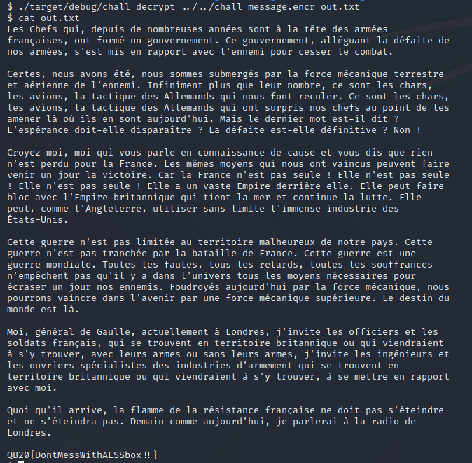


### Links

Introduction to Cryptography by Christof Paar
https://www.youtube.com/channel/UC1usFRN4LCMcfIV7UjHNuQg

series of cryptography lectures by Maria Eichlseder:
https://www.youtube.com/user/pardilchen/videos

On Reverse-Engineering S-Boxes with Hidden Design
Criteria or Structure – Alex Biryukov and Léo Perrin
https://eprint.iacr.org/2015/976.pdf
