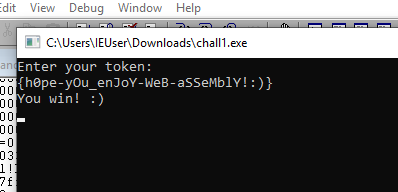

# **Quarkslab Challenge 2021 - WebAssembly**

Solution runs on linux, requires python3 and **ANGR**

```
$ make
$ python3 solve.py
```

The solver takes good 10-20 minutes to execute so be patient. And it requires some ram so if you run it in VM give it at least 4GB.

This challenge is fairly simple. The binary holds two web assembly modules one in wasm format (binary) and second in wat format (text). First module is located under chall1.exe+0x5890B0 and second module is stored under chall1.exe+0x591010. First module is the module where the key is being processed. Second module holds some tool procedures that are being called from module 1.  Module 1 does not reach these procedures directly instead it  jumps out to  functions in chall1.exe and these functions call proper procedure from second module. In module 1 external functions are mapped as op0-4

```
op0 => sub_140510D20 -> GetConsoleScreenBufferInfo
op1 => sub_140510B90 -> qword_140718378 -> f5
op2 => sub_1405109f0 -> qword_140718360 -> f8
op3 => sub_140510950 -> qword_140718358 -> f10
op4 => sub_1405108B0 -> qword_140718350 -> f9
```

The setup of the imports for module 1 is done in sub_140511600

The idea was to solve this with angr framework. 

The module1 was extracted and translated to C  using Web Assembly Toolkit. External functions were reversed and implemented in C. The original uvwasi runtime causes problems with angr so simplified minimal harness had to be created in C that emulates uvwasi runtime.

 Another problem was a call to wasm_rt_grow_memory at the startup. This causes an allocation of  additional 65k of memory which causes angr to explode. It turns out that skipping this call does not affect the execution of remaining wasm code. So in the solver script there is a hook that skips this call. 

On windows the binary expects to run in console where colors are yellow on yellow (letters/background) which is a bit dumb (otherwise it will throw "I refuse to run under this style.") . So it's easier to set a breakpoint on chall1.exe + 0x510D56 and overwrite eax value with 0xEE. 

In windbg:

```
bu chall1 + 0x510D56 "r eax=0xEE; gc"
```



